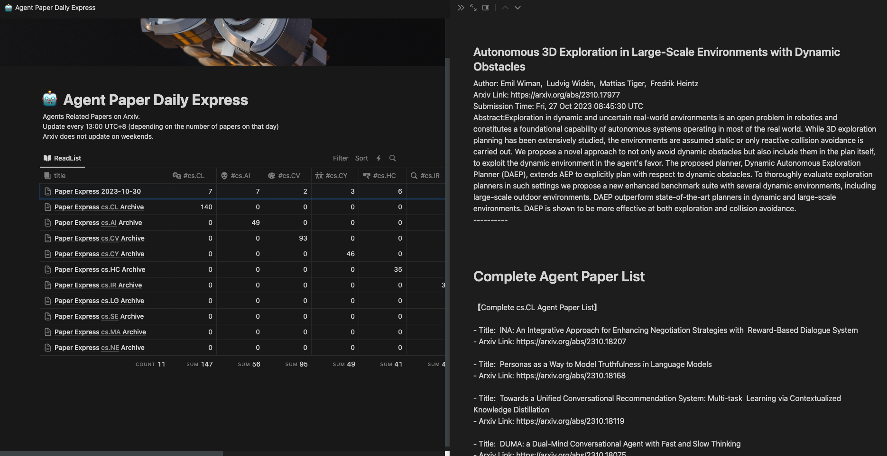

# ARXIV_DAILY
- a simple script to parse arxiv papers (based on keyword and category) then push it to Notion
- Demo [here](https://thinkwee.notion.site/d9d8ed114e3b4e9cac196c65afc77b6d?v=57763bfadc334c9dbba00e966baa942)(keyword=agent)
- 

## Quick Start
- prepare your notion 
```bash
    export database_id="YOUR_NOTION_DATABASE_ID" 
    export integration_token="YOUR_NOTION_INTEGRATION_TOKEN"
```
- parse recent paper and filter with keyword:
```python
    python3 execute_parse.py agent
```
- or search paper with keyword under certain category
```python
    python3 execute_search.py cs.CL agent
```
- both parse and search scripts have done deduplication on papers so you can crontab it daily for a paper daily express.